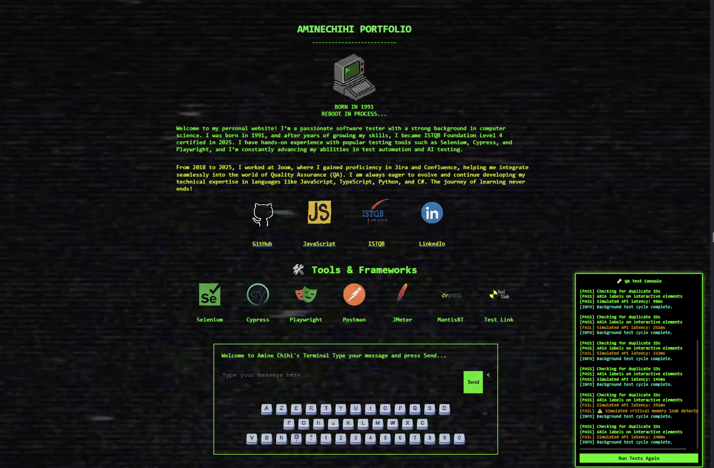

#  QA Portfolio – Interactive Test Console #

Welcome to my personal QA portfolio! This project showcases a **live QA Test Console** that simulates real-world testing scenarios directly inside a web portfolio. It’s designed to demonstrate my approach to **automated checks**, **accessibility**, and **continuous quality validation**.

## 🚀 Features

-  Automated UI and DOM checks
-  Continuous background tests (every 10 seconds)
-  Simulated tests for:
  - Broken links
  - ARIA label accessibility
  - Duplicate ID detection
  - Simulated API latency
  - Real bugs.
- 📋 Console output with status indicators (PASS, FAIL, WARN, INFO)
- 🎯 Recruiter-friendly: see testing mindset in action!

## 📸 Preview

 <!-- Replace with your own screenshot -->

## 🛠️ Tech Stack

- HTML5 + CSS3
- Vanilla JavaScript

## 📂 Project Structure

📁 /project-root
├── images # Media for the project
├── audio # audio files for the project
├── index.html # Main portfolio page
├── boot.js # Boot fonctionality
├── keyboard.js # keyboard input detection
├── testlog.js # Test logic and test runner
├── Jmeter.js # Jmeter terminal and auto test
├── Postman.js.js # API test tool to simulate Postman(you can use it to test the json file inside this project
├── playwright.js # Playwright terminal and auto test
├── Preview.png # Preview image for this project
├── selcyp.js.js # Selinium and Cypress terminal and auto test
├── mntl.js # MantiBT terminal script
├── data.json # API test purpose
├── sendsound.js # Handling error, bugs and report logs extractor script
├── vhs-overlay1.mp4 # overlay for the html page
├── style.css # Custom styles
└── README.md # You're here!

1- Open index.html in your browser.
2- Send me email if you are interested to hire me or send a bug report.
3- Test the website to reveal bugs.

🎯 Why This Project?
As a software tester with ISTQB certification and hands-on experience, I wanted to build something:

- Visual and engaging

- Reflecting real QA concerns

- That evolves with my learning in test automation and tooling

- This project combines creativity with quality assurance — and is open to evolution.
